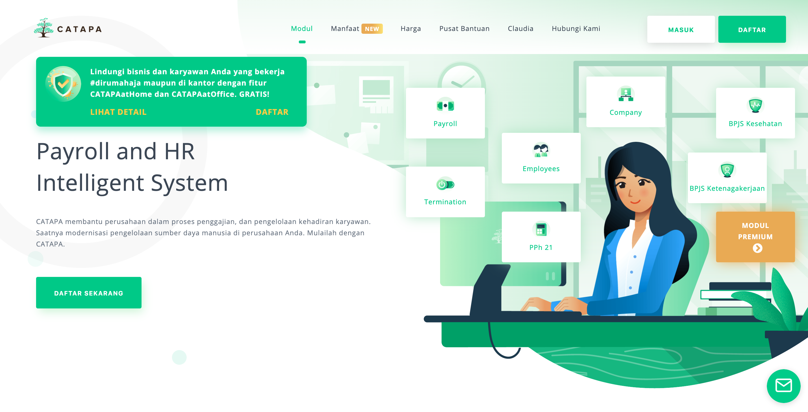

### Style Theory (2018 - present)

Style Theory (https://www.styletheory.co/sg/) is the first and largest fashion rental subscription-based startup in Southeast Asia with the presence in two countries : Indonesia and Singapore

Product manager for improving discoverability experience for two verticals (apparel and bags) in our application. I work within experience squad to handle browsing experience and personalization. My goal is creating a relevant and smooth experience for our users in finding items they want to rent. 

### GDP Labs (2015 - 2018)

GDP (Global Digital Prima) Labs, founded in 2012, is a software product development-centric organization based in Indonesia. It backed by Djarum Group, one of the most influential company in Indonesia. Its main goal is to help sister companies and incubate startups.

In GDP Labs, I was working under its startup incubation named Catapa (https://catapa.com/), Payroll and HR Intelligent System. 

I involved in building the product from stracth until assigned as a product manager for transactional modules and artificial intelligence products. As a product manager, I managed the end-to-end product development process start from gathering requirement, creating the wireframe, designing user experience, testing the product, presenting the result to client. 

Worked as a squad with members in multiple cities (Bandung, Jakarta, Bali, Yogyakarta, and Surabaya) and successfully launched the most challenging transactional module within 6 months. Contributes to save company cost by 80% and the modules is used by 15 companies in Indonesia. 

Converted lead from one of the biggest Catapa's client and increased company revenue by 50%. 

